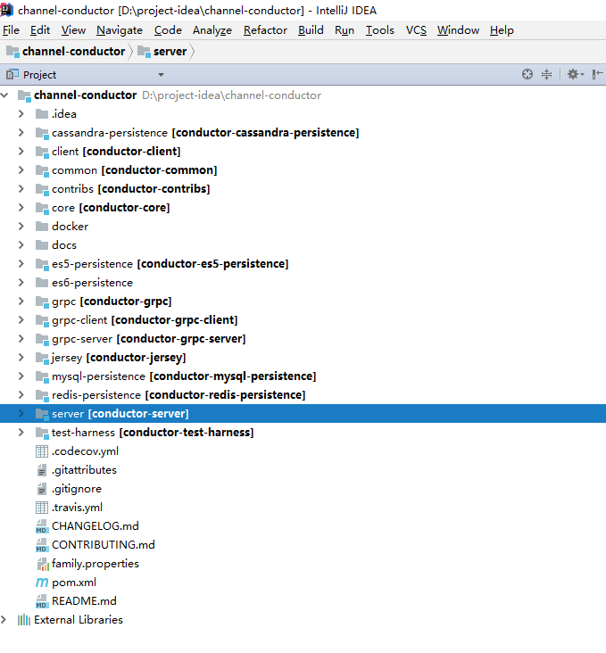

# 代码结构介绍

核心代码结构说明

- client层
  Conductor的使用场景是服务编排，必然会涉及client和server端也就是说在我们的微服务中的服务中可以使用client端来和conductor的server端进行通信，根据不同状态来执行相应任务。
- server层
  负责conductor server端的启动、工作流任务的启动，由server层调用core层实现分布式状态机控制和任务的调度。
- common层
  这一层主要涉及的是Task任务和Workflow工作流的元数据和请求参数定义，还有一些工具类。
- core层【核心模块】
  这一层主要包括的是核心类，包括：事件、队列功能类，还包括任务类型定义、每种类型任务的具体实现逻辑和映射关系，比如分支条件如何进行判断，逻辑表达式如何解析，并行任务如何执行等等。
- jersey层
  这个主要提供的是Swagger接口展示层，通过启动这个模块可以看到一个接口列表页面，用户可以在界面上操作接口实现任务和工作流元数据的编写和上传，还可以在界面上启动工作流引擎等。
- contribs层
  亚马逊消息SQS
- es-persistence
  这一层主要是持久层，根据请求版本不同包括es5和es6二个模块，作用主要包括将任务和工作流元数据保存到es中，还有就是将任务运行时数据进行保存，比如任务执行的状态，执行时间等等。
- mysql-persistence
  mysql持久层，存储任务和工作流定义的元数据。
- redis-persistence
  redis持久层，存储任务和工作流定义的元数据。
- conductor-cassandra-persistence
  cassandra持久层，存储任务和工作流定义的元数据。

> grpc、grpc-client、grpc-server是用于支持rpc通信相关的模块

## 核心类代码【待完善】