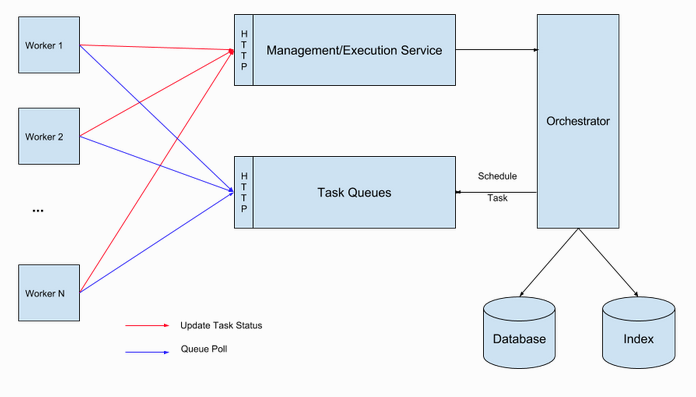
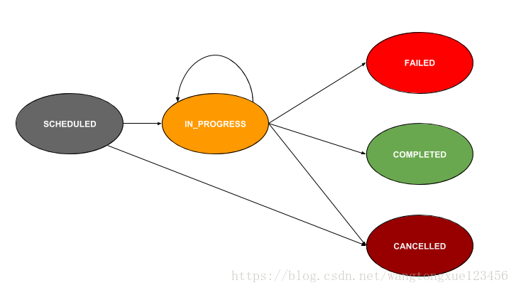

# 系统架构
## 1.Conductor架构图

## 2.任务生命周期

## 3.调用流程说明
- 首先在conductor server上定义task和workflow
- 通过接口启动workflow
- 编排服务会从存储中取得workflow和其中task的metadata，通过状态机服务判断当前要执行的task放入task queues，并置此task状态为SCHEDULED，等待worker认领
- 启动各微服务worker，在worker中声明当前worker对应的task定义的名字
- worker会轮询conductor server，如果发现有同名的任务被放入task queues里，认领此任务，并更新任务状态为IN_PROGRESS，然后开始执行worker内业务逻辑
- worker中业务逻辑执行完后，根据至执行结果，更新任务状态为COMPLETE或FAIL
- conductor server监听此任务如果变为COMPLETE或FAIL执行下一个节点或重试等逻辑操作，如此往复。
