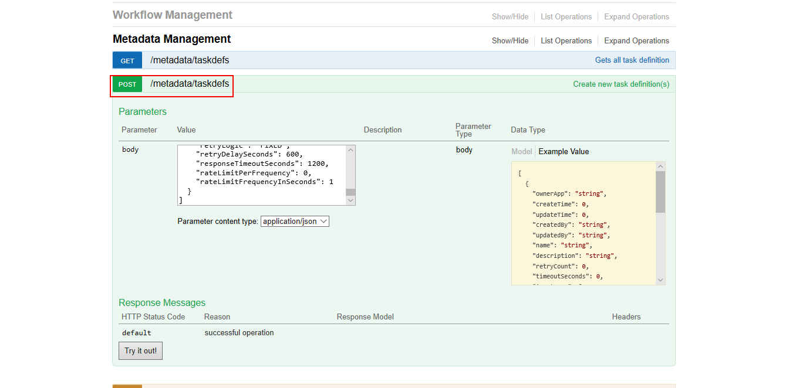
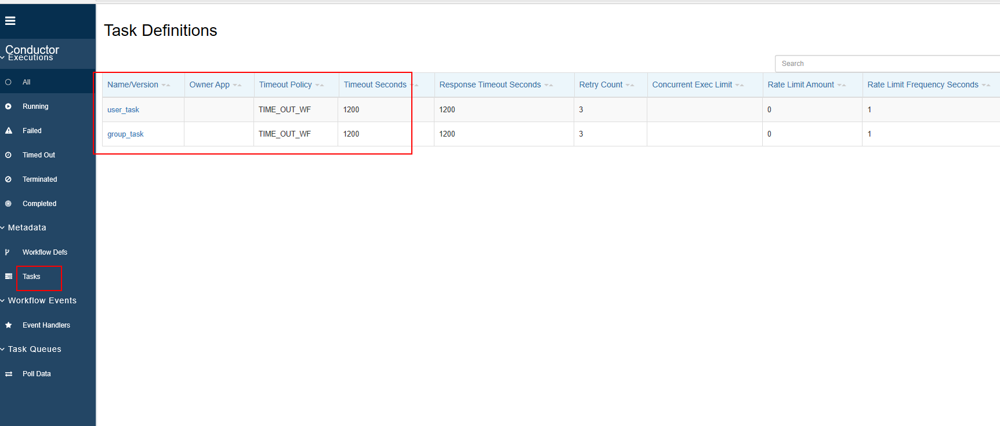
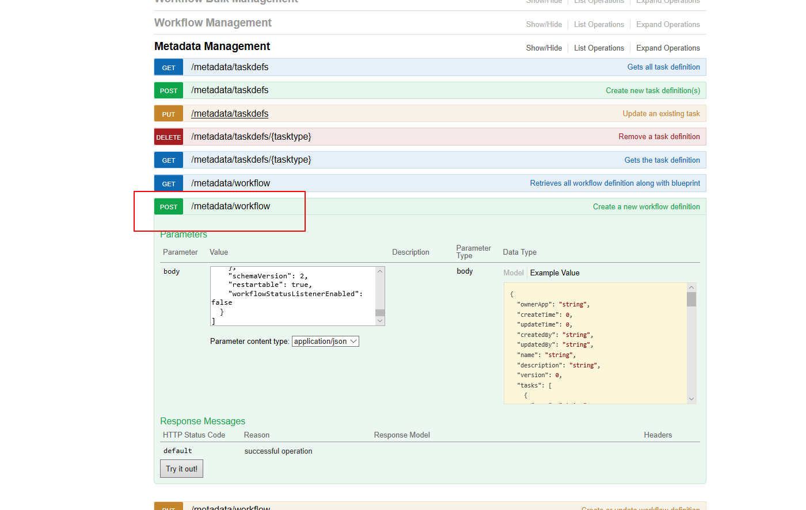
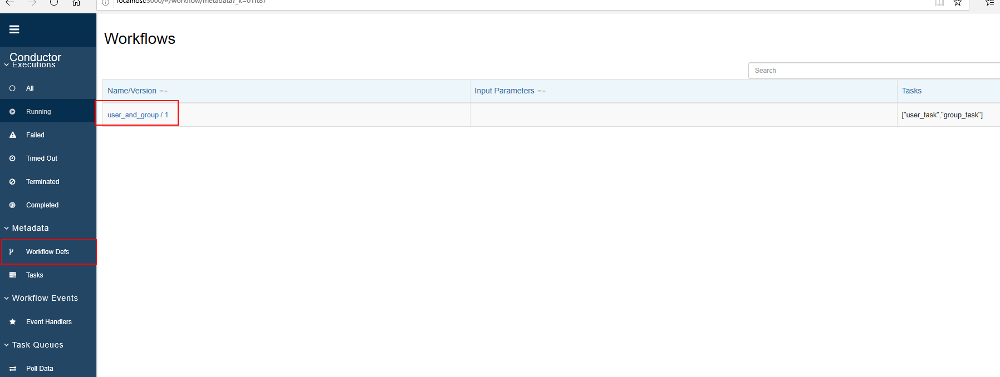
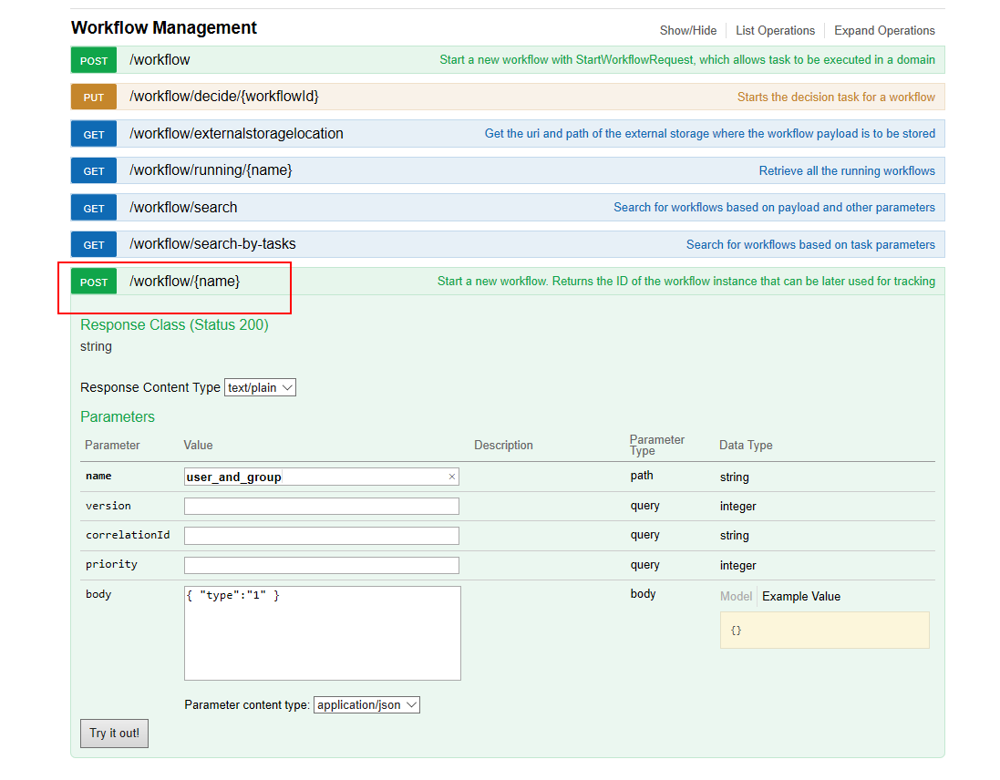
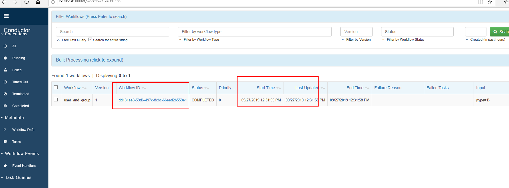
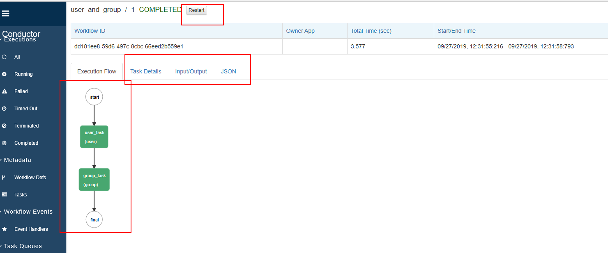

# 配置工作流

###### 编排SIMPLE工作任务示例

## 1. 定义任务

- 使用接口：http://localhost:8080/api/metadata/taskdefs
- HTTP方法:POST

- 页面查看

- 入参示例

~~~
[
    {
        "name": "user_task",
        "retryCount": 3,
        "timeoutSeconds": 1200,
        "inputKeys": [
            "type"
        ],
        "outputKeys": [
            "id",
            "name"
        ],
        "timeoutPolicy": "TIME_OUT_WF",
        "retryLogic": "FIXED",
        "retryDelaySeconds": 600,
        "responseTimeoutSeconds": 1200
    },
    {
        "name": "group_task",
        "retryCount": 3,
        "timeoutSeconds": 1200,
        "inputKeys": [
            "id",
            "name"
        ],
        "outputKeys": [
            "response",
            "result"
        ],
        "timeoutPolicy": "TIME_OUT_WF",
        "retryLogic": "FIXED",
        "retryDelaySeconds": 600,
        "responseTimeoutSeconds": 1200
    }
]
~~~

- 参数说明

| 领域                   | 描述                                                         | 笔记                    |
| ---------------------- | ------------------------------------------------------------ | ----------------------- |
| name                   | 任务类型                                                     | 唯一                    |
| retryCount             | 任务标记为失败时尝试重试的次数                               |                         |
| retryLogic             | 重试机制                                                     | 看下面的可能值          |
| timeoutSeconds         | 以毫秒为单位的时间，在此之后，如果在转换到IN_PROGRESS状态后未完成任务，则将任务标记为TIMED_OUT | 如果设置为0，则不会超时 |
| timeoutPolicy          | 任务的超时策略                                               | 看下面的可能值          |
| responseTimeoutSeconds | 如果大于0，则在此时间之后未更新状态时，将重新安排任务。当工作人员轮询任务但由于错误/网络故障而无法完成时很有用。 |                         |
| outputKeys             | 任务输出的键集。用于记录任务的输出                           |                         |

#### 重试逻辑

- FIXED ：重新安排任务后的任务 retryDelaySeconds
- EXPONENTIAL_BACKOFF：重新安排之后 retryDelaySeconds * attempNo

#### 超时政策

- RETRY ：再次重试该任务
- TIME_OUT_WF：工作流程标记为TIMED_OUT并终止
- ALERT_ONLY：注册计数器（task_timeout）

## 2. 定义工作流【串行工作流】

- 使用接口：http://localhost:8080/api/metadata/workflow
- HTTP方法:POST

- 页面查看

- 入参示例：

~~~
{
    "name": "user_and_group",
    "description": "Encodes a file and deploys to CDN",
    "version": 1,
    "tasks": [
        {
            "name": "user_task",
            "taskReferenceName": "user",
            "inputParameters": {
                "type": "${workflow.input.type}"
            },
            "type": "SIMPLE"
        },
        {
            "name": "group_task",
            "taskReferenceName": "group",
            "inputParameters": {
                "id": "${user.output.id}"
            },
            "type": "SIMPLE"
        }
    ],
    "outputParameters": {
        "result": "${group.output.result}"
    },
    "schemaVersion": 2
}
~~~

- 参数说明

| 领域             | 描述                                     | 笔记                                                     |
| ---------------- | ---------------------------------------- | -------------------------------------------------------- |
| name             | 工作流程的名称                           |                                                          |
| description      | 工作流程的描述性名称                     |                                                          |
| version          | 用于标识架构版本的数字字段。使用递增数字 | 启动工作流程执行时，如果未指定，则使用具有最高版本的定义 |
| tasks            | 一系列任务定义，如下所述。               |                                                          |
| outputParameters | 用于生成工作流输出的JSON模板             | 如果未指定，则将输出定义为上次执行的任务的输出           |
| inputParameters  | 输入参数列表。用于记录工作流程所需的输入 | 可选的                                                   |

其中，tasks工作流中的属性定义要按该顺序执行的任务数组。以下是每项任务所需的强制性最低参数：

| 领域              | 描述                                                         | 笔记                                 |
| ----------------- | ------------------------------------------------------------ | ------------------------------------ |
| name              | 任务名称。在开始工作流程之前，必须使用Conductor注册为任务类型 |                                      |
| taskReferenceName | 别名用于在工作流程中引用任务。必须是独一无二的。             |                                      |
| type              | 任务类型。SIMPLE用于远程工作人员或其中一个系统任务类型执行的任务 |                                      |
| description       | 任务描述                                                     | 可选的                               |
| optional          | 对或错。设置为true时 - 即使任务失败，工作流也会继续。任务的状态反映为COMPLETED_WITH_ERRORS | 默认为 false                         |
| inputParameters   | JSON模板，用于定义给予任务的输入                             | 有关详细信息，请参见“接线输入和输出” |

## 3. 任务执行

- 使用接口：http://localhost:8080/api/workflow/{workname}
- HTTP方法：POST

- 入参示例

在body中定义参数：

~~~
{
"type":"2"
}
~~~

## 4.编写用户任务
目前示例中使用的是HTTP任务，需要编写对应应用rest http接口

~~~

public class Task1Worker implements Worker {
    private String taskDefName;

    public Task1Worker(String taskDefName) {
        this.taskDefName = taskDefName;
    }

    @Override
    public String getTaskDefName() {
        return taskDefName;
    }

    @Override
    public TaskResult execute(Task task) {

        System.out.printf("Executing %s%n", taskDefName);
        System.out.println();
        System.out.printf("task："+ JSON.toJSONString(task));
        System.out.println();
        TaskResult result = new TaskResult(task);
        result.setStatus(TaskResult.Status.COMPLETED);

        //Register the output of the task
        if(task.getInputData().containsKey("type")){
            if("1".equals(task.getInputData().get("type").toString())){
                result.getOutputData().put("id", "1");
            }else{
                result.getOutputData().put("id", "-1");
            }
        }else{
            result.getOutputData().put("id", "-1");
        }
        System.out.printf("task response："+ JSON.toJSONString(result));
        System.out.println();
        return result;
    }
}

public class Task2Worker implements Worker {
    private String taskDefName;

    public Task2Worker(String taskDefName) {
        this.taskDefName = taskDefName;
    }

    @Override
    public String getTaskDefName() {
        return taskDefName;
    }

    @Override
    public TaskResult execute(Task task) {

        System.out.printf("Executing %s%n", taskDefName);
        System.out.println();
        System.out.printf("task："+ JSON.toJSONString(task));
        System.out.println();
        TaskResult result = new TaskResult(task);
        result.setStatus(TaskResult.Status.COMPLETED);

        if(task.getInputData().containsKey("id")){
            if("1".equals(task.getInputData().get("id").toString())){
                result.getOutputData().put("result", "success");
            }else{
                result.getOutputData().put("result", "default");
            }
        }else{
            result.getOutputData().put("result", "default");
        }
        System.out.printf("task response："+ JSON.toJSONString(result));
        System.out.println();
        return result;
    }
}

@EnableEurekaClient
@EnableFeignClients
@EnableHystrix
@EnableAsync //开启异步调用
@SpringBootApplication(exclude={DataSourceAutoConfiguration.class})
public class DemoApplication {

    private static final Logger logger = LoggerFactory.getLogger(DemoApplication.class);

    public static void main(String[] args) {
        ApplicationContext applicationContext = SpringApplication.run(DemoApplication.class, args);
        logger.info("渠道端-服务启动完毕！");

        TaskClient taskClient = new TaskClient();
        taskClient.setRootURI("http://localhost:8080/api/");		//Point this to the server API

        int threadCount = 2;			//number of threads used to execute workers.  To avoid starvation, should be same or more than number of workers

        Worker worker1 = new Task1Worker("user_task");
        Worker worker2 = new Task2Worker("group_task");

        //Create WorkflowTaskCoordinator
        WorkflowTaskCoordinator.Builder builder = new WorkflowTaskCoordinator.Builder();
        WorkflowTaskCoordinator coordinator = builder.withWorkers(worker1, worker2).withThreadCount(threadCount).withTaskClient(taskClient).build();

        //Start for polling and execution of the tasks
        coordinator.init();
        logger.info("worker启动完毕！");
    }

}

~~~
## 5. 查看执行结果

- 调用接口：http://localhost:8080/api/workflow/{workid}
- HTTP方法： GET
- 页面查看

- 输出内容示例

~~~
{
   "result": "default"
}
~~~

## 5.其他工作流【待完善】
除了线性工作量，conductor还支持很多更加复杂的工作流，如并行工作流、分支工作流等